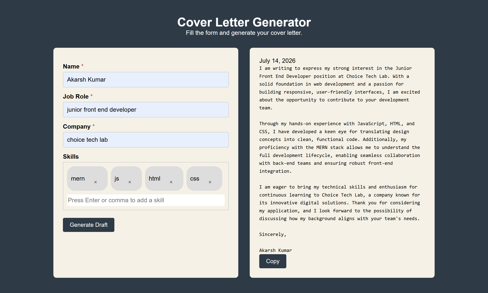

# COVER LETTER GENERATOR

An AI-powered web application that generates professional and personalised cover letters based on user inputs. The application uses the **Google Gemini API** to create tailored cover letters for different job roles with a clean, responsive interface.

---

## 🚀 Features

* ✨ AI-powered cover letter generation using **Google Gemini API**
* 📝 Personalised cover letters based on user details
* ⚡ Fast and responsive user interface
* ⏳ Loading indicator while generating content
* ❌ Error handling for failed API requests
* 📋 One-click copy to clipboard
* 📱 Responsive design for desktop and mobile

---

## 🛠️ Tech Stack

### Frontend

* HTML5
* CSS3
* JavaScript (ES6)

### Backend

* Node.js
* Express.js

### AI

* Google Gemini API

---

## 📂 Project Structure

```text
COVER-LETTER-GENERATOR/
│── index.html
│── style.css
│── script.js
│── server.js
│── package.json
│── package-lock.json
│── .gitignore
│── Screenshot.png
```

---

## ⚙️ Installation

### 1. Clone the repository

```bash
git clone https://github.com/Akarsh-Coding/COVER-LETTER-GENERATOR.git
cd COVER-LETTER-GENERATOR
```

### 2. Install dependencies

```bash
npm install
```

### 3. Configure the Gemini API Key

Create a `.env` file in the project root.

```env
GEMINI_API_KEY=your_api_key_here
PORT=3000
```

### 4. Start the server

```bash
node server.js
```

The application will be available at:

```
http://localhost:3000
```

---

## 📸 Screenshot



---

## 📌 Future Improvements

* Export cover letters as PDF
* Multiple cover letter templates
* Save generated cover letters
* User authentication
* Resume upload and analysis
* Support for multiple AI models

---

## 🤝 Contributing

Contributions are welcome! Feel free to fork the repository, create a feature branch, and submit a pull request.

---

## 📄 License  

This project is licensed under the MIT License.

---

## 👨‍💻 Author

**Akarsh Kumar**
